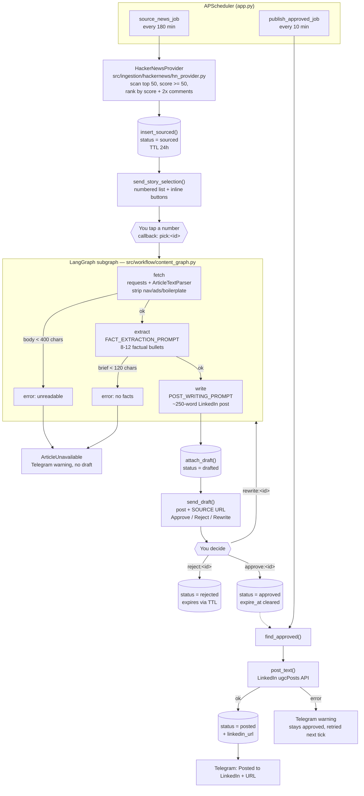

# Knowledge Extract AI

Knowledge Extract AI sources tech stories, extracts the facts out of them, drafts
LinkedIn posts grounded in those facts, and runs every draft past a human on
Telegram before publishing to LinkedIn.

Nothing is published without an explicit tap on **Approve**. Nothing is drafted
from a headline the pipeline could not actually read.

```
Hacker News  ->  fetch + clean article  ->  extract facts  ->  write draft
                                                                   |
                                              Telegram (you) approve / reject / rewrite
                                                                   |
                                                              LinkedIn
```

---

## Table of contents

- [How it works](#how-it-works)
- [Flow diagram](#flow-diagram)
- [Draft lifecycle](#draft-lifecycle)
- [Repository layout](#repository-layout)
- [Key modules explained](#key-modules-explained)
- [Data model](#data-model)
- [Configuration](#configuration)
- [Running it](#running-it)
- [Design decisions worth knowing](#design-decisions-worth-knowing)
- [Extending the project](#extending-the-project)
- [Troubleshooting](#troubleshooting)
- [Related documents](#related-documents)

---

## How it works

The app is a long-running asyncio process ([app.py](app.py)) that owns three things:

1. **A Telegram bot** (long polling) that receives your button taps.
2. **A sourcing job** on a 180-minute interval — pulls ranked Hacker News
   stories, persists them to MongoDB, and sends you a numbered pick list.
3. **A publishing job** on a 10-minute interval — posts every draft you approved
   to LinkedIn and marks it `posted`.

The middle of the pipeline (pick a story → read the draft → approve/reject/
rewrite) is human-driven and runs entirely through Telegram callbacks. There is
**no human-in-the-loop node inside the graph**; the graph runs the automated
stretch only (fetch → extract → write) and returns.

All state lives in MongoDB, and every Telegram button carries the Mongo document
id as its `callback_data`. That means the bot can be restarted at any moment —
mid-review, mid-approval — and the buttons in your chat history still work.

## Flow diagram



### The graph itself

[src/workflow/content_graph.py](src/workflow/content_graph.py) compiles a three-node
`StateGraph` over a `ContentState` TypedDict:

| Node | Function | Reads | Writes | Fails when |
|---|---|---|---|---|
| `fetch` | `_fetch_node` | `url`, `title` | `content` (capped at 6 000 chars) | article text is `None` → `error` |
| `extract` | `_extract_node` | `title`, `content` | `brief` | brief < 120 chars → `error` |
| `write` | `_write_node` | `title`, `brief`, `is_rewrite` | `draft` | — |

Conditional edges (`_after_fetch`, `_after_extract`) short-circuit to `END` the
moment `error` is set, so a failed fetch never reaches the model.
`generate_draft()` converts that `error` into an `ArticleUnavailable` exception,
which [telegram_handler.py](src/integration/telegram_handler.py) turns into a
"Skipped …" message instead of a post.

## Draft lifecycle

The Mongo `status` field is the **single source of truth**. No in-memory state,
no session objects.

```mermaid
stateDiagram-v2
    [*] --> sourced: source_news_job
    sourced --> drafted: you tap a number, graph produces a draft
    drafted --> drafted: you tap Rewrite
    drafted --> approved: you tap Approve
    drafted --> rejected: you tap Reject
    approved --> posted: publish_approved_job
    sourced --> [*]: TTL 24h
    drafted --> [*]: TTL 24h
    rejected --> [*]: TTL 24h
    posted --> [*]: kept forever
```



Retention is enforced by a MongoDB TTL index on `expire_at`
(`expireAfterSeconds=0`, so the field is an absolute delete time):

- `sourced`, `drafted`, `rejected` carry an `expire_at` and self-delete after
  `SOURCED_TTL_HOURS` (default 24).
- `approved` and `posted` have `expire_at` set to `null`, which the TTL index
  ignores — those records are permanent.
- `attach_draft()` refreshes the clock, so you get a full window to review a
  draft rather than counting from when the story was sourced.

## Repository layout

```
ai-writer/
├── app.py                          # entrypoint: bot + APScheduler jobs
├── requirements.txt
├── .env.example                    # every env var, documented
│
├── models/                         # plain data shapes (pydantic / TypedDict)
│   ├── article_format.py           # ArticleFormat
│   ├── topics.py                   # TopicIdea, TopicList (structured output)
│   └── workflow_state.py           # legacy end-to-end WorkflowState
│
└── src/
    ├── config.py                   # env loading + ALL prompt templates
    ├── llm.py                      # single LLM factory (claude | ollama)
    │
    ├── ingestion/                  # where stories come from
    │   ├── article_provider.py     # ArticleProvider ABC
    │   ├── base.py                 # Ingestor ABC (legacy alias)
    │   ├── provider_registry.py    # name -> provider class registry
    │   ├── run_hackernews.py       # standalone CLI preview/export
    │   ├── hackernews/             # ACTIVE provider
    │   ├── reddit/                 # stub (needs API credentials)
    │   └── rss/                    # stub
    │
    ├── processing/                 # article text handling
    │   ├── fetcher/fetcher.py      # HTTP + HTML -> clean text (the heavy one)
    │   ├── cleaner/cleaner.py      # normalize the article dict
    │   └── embeddings/             # placeholder
    │
    ├── workflow/                   # the graph and its stages
    │   ├── content_graph.py        # LangGraph: fetch -> extract -> write
    │   ├── extraction/extraction.py# stage 1: article -> factual brief
    │   ├── writing/writing.py      # stage 2 wrapper
    │   ├── post_writer.py          # stage 2: brief -> LinkedIn post
    │   ├── reviewing/              # stub node (unused by the live path)
    │   ├── publishing/             # JSON artifact dump (unused by live path)
    │   └── topic_generation/       # HN trend analysis -> structured TopicList
    │
    ├── integration/                # the outside world
    │   ├── telegram_bot.py         # send helpers + inline keyboards
    │   ├── telegram_handler.py     # callback dispatch (the orchestrator)
    │   └── linkedin_client.py      # ugcPosts publishing
    │
    ├── repository/
    │   ├── draft_repository.py     # MongoDB lifecycle (source of truth)
    │   └── article_repository.py   # file-based JSON export
    │
    ├── scheduler/jobs.py           # the two interval jobs
    └── shared/save.py              # JSON dump helper
```

## Key modules explained

### [app.py](app.py) — entrypoint
Puts `./` and `./src` on `sys.path` (which is why imports look like
`from config import …` rather than `from src.config import …` in most modules),
builds the `telegram.ext.Application` with a single `CallbackQueryHandler`,
registers both interval jobs on an `AsyncIOScheduler`, and fires one sourcing
cycle immediately so you don't wait 3 hours for the first pick list.

### [src/scheduler/jobs.py](src/scheduler/jobs.py) — the two jobs
Both jobs wrap blocking calls in `asyncio.to_thread` so `requests` and `pymongo`
never stall the Telegram event loop.

- `source_news_job` — fetch 6 ranked stories → `insert_sourced` each → send the
  pick list.
- `publish_approved_job` — for each approved record, `post_text` then mark
  `posted` with the resulting URL. A `LinkedInError` is reported to Telegram and
  the record is left `approved`, so the next tick retries it.

### [src/ingestion/hackernews/hn_provider.py](src/ingestion/hackernews/hn_provider.py) — sourcing
Hits the HN Firebase API, inspects the first 50 top-story ids, and drops:
- items with no external `url` (Ask HN / self posts — nothing to fetch), and
- items scoring under 50 (low signal).

Survivors are ranked by `score + 2 × descendants`, which deliberately favours
**discussed** stories over merely upvoted ones, then trimmed to the limit.

### [src/processing/fetcher/fetcher.py](src/processing/fetcher/fetcher.py) — HTML → text
A dependency-free extractor built on `html.parser.HTMLParser`. The details that
matter:

- **Browser User-Agent** — many sites 403 the default `python-requests` agent.
- **Depth-based skipping.** When a noise element opens, the parser records its
  depth and ignores everything until the depth drops back. Comparing *depths*
  rather than tag names means a `<div>` nested inside a skipped `<div>` doesn't
  end the skip early.
- **Void tags never open a skip region** — ``, `<br>` etc. have no end tag,
  so a skip started on one would swallow the rest of the document.
- **Whole-word noise matching** on `class`/`id` (`nav`, `sidebar`, `ad`,
  `paywall`, `comments`, …). Substring matching would have `ad` firing on
  Tailwind classes like `shadow-lg` and `leading-relaxed`.
- **Content containers are never noise** — `<article class="newsletter-post">`
  (Substack) once got discarded wholesale by a class-name match.
- **Boilerplate stripping** for chrome that survives tag filtering
  ("Skip to content", "Subscribe", cookie banners), matched per whole paragraph
  so an article *about* advertisements keeps its text.
- **A 400-character floor.** Below that the page is a JS shell, consent wall or
  nav stub, and `fetch_article` returns `None` — which the graph treats as fatal.

### [src/workflow/extraction/extraction.py](src/workflow/extraction/extraction.py) + [post_writer.py](src/workflow/post_writer.py) — the two-stage draft
Stage 1 turns up to 6 000 chars of article into 8–12 complete-sentence bullets.
Stage 2 writes the post using *only* those bullets.

Both stages raise `ValueError` on empty input rather than proceed, because a
draft written from a title alone is fabrication that reads exactly like fact.

### [src/integration/telegram_handler.py](src/integration/telegram_handler.py) — the orchestrator
Callback data is `"<action>:<draft_id>"`. Each action does one bounded chunk of
work against the Mongo record and stops:

| Action | Effect |
|---|---|
| `pick` | run the graph, `attach_draft`, send the draft for review |
| `approve` | `status = approved` (publish job takes it from there) |
| `reject` | `status = rejected` |
| `rewrite` | re-run the graph with `is_rewrite=True`, resend |

Marking a draft clears its inline keyboard (by editing the message with no
`reply_markup`), so the same draft can't be acted on twice, while the post text
stays readable in your chat history.

### [src/llm.py](src/llm.py) — the model seam
The only place in the codebase that constructs a chat model. `LLM_PROVIDER`
picks `ChatAnthropic` or `ChatOllama`; everything else calls `get_chat_model()`.
`get_structured_llm(schema)` returns a model bound to a pydantic schema for the
topic-analysis path.

Note: no `temperature` is passed for Claude — `claude-opus-4-8` rejects sampling
parameters with a 400. Tone is steered through the prompt instead.

## Data model

One MongoDB collection: `KnowledgeExtractor.articles`.

| Field | Type | Meaning |
|---|---|---|
| `_id` | ObjectId | stringified into every Telegram `callback_data` |
| `title` | str | story headline from the provider |
| `url` | str | source article URL — shown with every draft |
| `score` | int | provider ranking signal |
| `draft` | str \| null | generated post body |
| `status` | str | `sourced` / `drafted` / `approved` / `posted` / `rejected` |
| `created_at` | datetime | insert time |
| `updated_at` | datetime | last status change |
| `posted_at` | datetime \| null | reserved |
| `linkedin_url` | str \| null | set on successful publish |
| `expire_at` | datetime \| null | TTL delete time; `null` = keep forever |

Index: `expire_at` with `expireAfterSeconds=0`, created at import time by
[draft_repository.py](src/repository/draft_repository.py).

## Configuration

Copy [.env.example](.env.example) to `.env` and fill it in.

| Variable | Default | Purpose |
|---|---|---|
| `TELEGRAM_BOT_TOKEN` | — | from [@BotFather](https://t.me/BotFather); `BOT_TOKEN` also accepted |
| `TELEGRAM_CHAT_ID` | — | your chat id; `CHAT_ID` also accepted |
| `LLM_PROVIDER` | `claude` | `claude` (Anthropic API) or `ollama` (local) |
| `ANTHROPIC_API_KEY` | — | required when `LLM_PROVIDER=claude` |
| `CLAUDE_MODEL` | `claude-opus-4-8` | Anthropic model id |
| `CLAUDE_MAX_TOKENS` | `4096` | response cap |
| `OLLAMA_MODEL` | `qwen3:4b` | local model tag |
| `OLLAMA_NUM_CTX` | `4096` | context window; **do not go below ~3072** — Ollama silently truncates the prompt and the model starts inventing from the headline |
| `OLLAMA_NUM_GPU` | `99` | layers forced onto the GPU; `99` = all, blank = auto |
| `MONGODB_URI` | `mongodb://localhost:27017/` | connection string |
| `MONGODB_DB_NAME` | `KnowledgeExtractor` | database name |
| `SOURCED_TTL_HOURS` | `24` | how long in-flight records survive |
| `LINKEDIN_ACCESS_TOKEN` | — | member token with `w_member_social` |
| `LINKEDIN_AUTHOR_URN` | — | e.g. `urn:li:person:AbC123` |

**Prompts live in [src/config.py](src/config.py)**, not in a template directory:
`FACT_EXTRACTION_PROMPT_TEMPLATE`, `POST_WRITING_PROMPT_TEMPLATE`,
`REWRITE_PROMPT_SUFFIX`, `TOPIC_ANALYSIS_PROMPT_TEMPLATE`. Timing constants
(`SOURCE_INTERVAL_MINUTES`, `PUBLISH_INTERVAL_MINUTES`) are in [app.py](app.py);
`_STORIES_PER_CYCLE` is in [src/scheduler/jobs.py](src/scheduler/jobs.py).

## Running it

Requires Python 3.11+ (3.14 in use here) and a reachable MongoDB.

```bash
python3 -m venv .venv && source .venv/bin/activate
pip install -r requirements.txt
cp .env.example .env    # then fill it in
```

Start MongoDB **before** the app — `draft_repository.py` connects at import time,
so a missing database fails at startup rather than at first use:

```bash
mongod --dbpath /data/db          # or: sudo systemctl start mongod
mongosh --eval 'db.runCommand({ ping: 1 })'
```

If you're running locally with Ollama:

```bash
ollama serve
ollama pull qwen3:4b              # or gemma2:9b
```

Then:

```bash
python app.py
```

You'll see `Bot running. Sourcing news every 180m, publishing approved drafts
every 10m.` and a pick list should arrive in Telegram within a minute.

**Preview sourcing without the bot** (also exports approved records to
`./data/articles.json`):

```bash
python -m src.ingestion.run_hackernews
```

## Design decisions worth knowing

**Two prompts, not one.** A single combined prompt does not survive a small local
model. A ~3 400-character instruction block made `gemma2:9b` drop the source
article entirely and emit generic filler. Splitting into *extract facts* then
*write from facts* keeps each prompt short enough that the model both follows
instructions and reads its source. See
[docs/plans/two-stage-grounded-drafts.md](docs/plans/two-stage-grounded-drafts.md).

**Fail loudly, never invent.** If the article text can't be read, the pipeline
stops and tells you. Asking a model for 250 words about a headline it can't read
produces confident invention — fake numbers, fake quotes — which is worse than no
draft, because it reads exactly like a real one.

**Bullets must be complete sentences.** A brief of bare figures (`- 40x cheaper`,
`- 21%`) makes stage 2 invent what they measure. `FACT_EXTRACTION_PROMPT_TEMPLATE`
requires each bullet to say *what the thing is*, and to drop any number whose
referent isn't clear.

**No first-person appropriation.** Posts publish under your own name, so they must
never restate the source author's incidents as yours ("my GPU died", "I found the
token"). Specific events go in third person; first person is reserved for opinion
and judgment. Enforced by the rules block of `POST_WRITING_PROMPT_TEMPLATE` — if
you edit it, re-test with a first-person source article.

**Every draft ships with its source URL.** Posts are first person with no
citations, so a grounded claim and an invented one read identically in Telegram.
The link (appended by `send_draft(..., source_url=...)`) is the only way to verify
before approving.

**Mongo ids in callback data, never list indexes.** This is what makes the bot
restart-safe and lets many drafts be in flight at once.

**Only approved work persists.** Everything else is transient state that exists
purely so the Telegram flow has a stable id to reference, and MongoDB's TTL index
sweeps it up.

## Extending the project

**Add a story source.** Implement `ArticleProvider.fetch_top_articles(limit)` in
`src/ingestion/<source>/`, returning dicts with `title`, `url`, `score` and
optionally `comments`. Register it with `registry.register("<name>", Provider)`,
then swap it into `source_news_job`. Stubs already exist for Reddit and RSS —
note that **Reddit returns 403 for all anonymous access** (JSON and RSS, any user
agent), so it needs free credentials from reddit.com/prefs/apps.

**Add a graph stage.** Add a field to `ContentState`, write a `_node(state) ->
dict` function, register it in `_build_graph()`, and wire the edge. If the stage
can fail in a way that would leave the post ungrounded, set `state["error"]` and
add a conditional edge to `END` — that's the pattern `fetch` and `extract` use.

**Change the voice.** Edit `POST_WRITING_PROMPT_TEMPLATE` in
[src/config.py](src/config.py). Keep it short: prompt length is the failure mode
on small local models, and the banned-word list that used to live there is
exactly what broke instruction following.

**Swap models.** Change `LLM_PROVIDER` in `.env`. Nothing else instantiates a
chat model, so no code changes are needed.

## Troubleshooting

| Symptom | Cause / fix |
|---|---|
| App exits at startup with a pymongo error | `mongod` isn't running. A manually started `mongod` doesn't survive its terminal closing. |
| `Telegram bot token is not configured` | `TELEGRAM_BOT_TOKEN` (or `BOT_TOKEN`) missing from `.env`. |
| `⚠️ Skipped "…": Could not read the article text` | The page is JS-rendered, paywalled, or under the 400-char floor. Working as intended — pick another story. |
| `Could not pull any facts out of the source page` | The fetch cleared the floor but was boilerplate. Same remedy. |
| Draft is generic filler with no article specifics | The model dropped its source — usually `OLLAMA_NUM_CTX` too low, or a prompt edit that made the instruction block too long. |
| `LinkedIn post failed (401)` | Token expired. Re-run the OAuth steps in [LINKEDIN_SETUP.md](LINKEDIN_SETUP.md). The record stays `approved` and retries. |
| Ollama offloads only ~56% to GPU | Set `OLLAMA_NUM_GPU=99` and drive the display from the iGPU. See [LOCAL_LLM_GPU.md](LOCAL_LLM_GPU.md). |
| Sourced stories vanished overnight | Working as intended — the 24 h TTL. Approve what you want to keep. |

## Related documents

- [CLAUDE.md](CLAUDE.md) — working agreements and content rules for AI assistants
- [LOCAL_LLM_GPU.md](LOCAL_LLM_GPU.md) — full Ollama / GPU offload runbook
- [MONGODB_RUNBOOK.md](MONGODB_RUNBOOK.md) — starting and inspecting MongoDB
- [LINKEDIN_SETUP.md](LINKEDIN_SETUP.md) — one-time OAuth and URN setup
- [docs/plans/](docs/plans/) — design plans, including the two-stage drafting rationale
