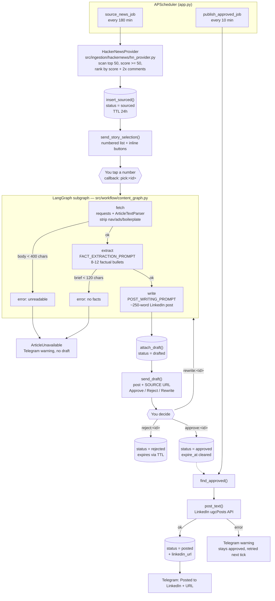
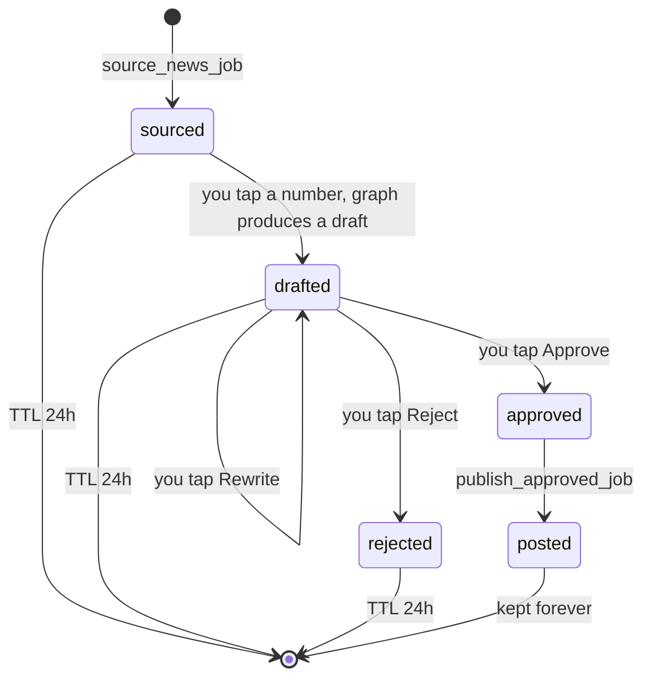

# Groundtruth

**A source-grounded, human-gated publishing pipeline.**

Groundtruth sources tech stories, extracts the verifiable facts out of them,
drafts LinkedIn posts built only on those facts, and routes every draft through a
human on Telegram before anything reaches LinkedIn.

The name is the design constraint. Most "AI writer" projects will happily generate
a confident 250-word post about a headline they never read — and that output is
indistinguishable from the real thing, which is what makes it dangerous when it
publishes under your own name. Groundtruth refuses. If the source can't be read,
the pipeline stops and tells you.

```
Hacker News  ->  fetch + clean article  ->  extract facts  ->  write draft
                                                                   |
                                              Telegram (you) approve / reject / rewrite
                                                                   |
                                                              LinkedIn
```

**Two guarantees the code actually enforces:**

1. **Nothing publishes without an explicit human tap.** There is no autonomous
   publish path. The approval gate is a hard edge in the architecture, not a
   config flag.
2. **Nothing is drafted from a page the pipeline could not read.** Three
   independent floors — a 400-char body minimum, a fail-closed fetch node, and a
   120-char minimum on the extracted brief — short-circuit to failure rather than
   let the model improvise.

---

## Table of contents

- [Architecture at a glance](#architecture-at-a-glance)
- [Quickstart](#quickstart)
- [Environment it runs on](#environment-it-runs-on)
- [Engineering decisions](#engineering-decisions)
- [Flow diagram](#flow-diagram)
- [The graph itself](#the-graph-itself)
- [Draft lifecycle](#draft-lifecycle)
- [Repository layout](#repository-layout)
- [Key modules explained](#key-modules-explained)
- [Data model](#data-model)
- [Configuration](#configuration)
- [Extending the project](#extending-the-project)
- [Troubleshooting](#troubleshooting)
- [Related documents](#related-documents)

---

## Architecture at a glance

| Concern | Approach | Where |
|---|---|---|
| **Orchestration** | A compiled LangGraph `StateGraph` over a `ContentState` TypedDict, with **fail-closed conditional edges** — any stage that cannot guarantee grounding sets `error` and short-circuits to `END` before the model is reached | [src/workflow/content_graph.py](src/workflow/content_graph.py) |
| **Grounding** | **Two-stage prompt decomposition**: article → factual brief → post. Stage 2 is shown the brief and *nothing else*, so it has no source material to embellish from | [extraction.py](src/workflow/extraction/extraction.py), [post_writer.py](src/workflow/post_writer.py) |
| **Human-in-the-loop** | Deliberately **outside** the graph. Approval is an async, open-ended human decision; modelling it as a graph node would mean holding process state across hours of wall-clock time | [src/integration/telegram_handler.py](src/integration/telegram_handler.py) |
| **State** | **Status-as-single-source-of-truth.** One Mongo `status` field drives the whole lifecycle. No in-memory sessions, no conversation state | [src/repository/draft_repository.py](src/repository/draft_repository.py) |
| **Crash safety** | **Idempotent, restart-safe callback protocol.** Every Telegram button carries the Mongo `_id` as `callback_data`, so buttons in your chat history keep working across restarts — mid-review, mid-approval | [telegram_bot.py](src/integration/telegram_bot.py) |
| **Retention** | **TTL-swept in-flight state.** A Mongo TTL index on `expire_at` auto-deletes transient records; reaching `approved` clears the field and makes the record permanent | [draft_repository.py](src/repository/draft_repository.py) |
| **Delivery** | **At-least-once publishing with retry-on-tick.** A failed LinkedIn call leaves the record `approved`, so the next scheduler tick retries it instead of losing the work | [src/scheduler/jobs.py](src/scheduler/jobs.py) |
| **Sourcing** | **Pluggable providers** behind an `ArticleProvider` ABC plus a name→class registry, ranked on a *discussion-weighted* signal rather than raw upvotes | [src/ingestion/](src/ingestion/) |
| **Model seam** | A **single LLM factory** with pluggable provider adapters, lazily imported. `LLM_PROVIDER` switches the whole pipeline between a local model and any hosted chat API with one env var and zero code changes — no vendor name appears anywhere else in the codebase | [src/llm.py](src/llm.py) |
| **Text extraction** | A dependency-free HTML→text extractor using **depth-based skip regions**, whole-word noise matching, and a hard content floor | [src/processing/fetcher/fetcher.py](src/processing/fetcher/fetcher.py) |

Runtime shape: one long-running asyncio process ([app.py](app.py)) owning a
Telegram long-polling bot and two APScheduler interval jobs. Blocking I/O
(`requests`, `pymongo`) is pushed through `asyncio.to_thread` so it never stalls
the event loop.

## Quickstart

**Prerequisites**

- Python 3.11+ (3.14 in use here)
- A reachable MongoDB
- A Telegram bot token and your chat id — from [@BotFather](https://t.me/BotFather)
- A model: either [Ollama](https://ollama.com) running locally (no API key, the
  default), or credentials for any hosted chat API
- *(Optional, to actually publish)* LinkedIn OAuth — see [LINKEDIN_SETUP.md](LINKEDIN_SETUP.md).
  Leave it blank to run the whole pipeline up to the approval gate.

**1. Install**

```bash
git clone https://github.com/AhmerKhan153/groundtruth.git
cd groundtruth
python3 -m venv .venv && source .venv/bin/activate
pip install -r requirements.txt
cp .env.example .env          # then fill it in
```

**2. Start MongoDB — before the app, not after**

[draft_repository.py](src/repository/draft_repository.py) opens its client and
creates the TTL index **at import time**. A missing database therefore fails at
startup rather than at first use, which is the behaviour you want but is
surprising the first time:

```bash
mongod --dbpath /data/db      # or: sudo systemctl start mongod
mongosh --eval 'db.runCommand({ ping: 1 })'
```

A manually started `mongod` does not survive its terminal closing.

**3. If running the model locally**

```bash
ollama serve
ollama pull qwen3:4b          # or gemma2:9b
```

`LLM_PROVIDER=ollama` is already the default. To use a hosted API instead, set
`LLM_PROVIDER=openai`, `LLM_MODEL` to that provider's model id, and `LLM_API_KEY`.
GPU offload tuning is its own runbook: [LOCAL_LLM_GPU.md](LOCAL_LLM_GPU.md).

**4. Run**

```bash
python app.py
```

**What you should see:** the line `Bot running. Sourcing news every 180m,
publishing approved drafts every 10m.`, then a numbered pick list in Telegram
within about a minute — the first sourcing cycle fires immediately rather than
waiting out the 180-minute interval. Tap a number, wait for the draft, and check
it against the source URL that ships with it.

**Preview sourcing without the bot** (also exports approved records to
`./data/articles.json`):

```bash
python -m src.ingestion.run_hackernews
```

## Environment it runs on

This is a single-machine project: one laptop runs the app, the database and, when
`LLM_PROVIDER=ollama`, the model itself. Nothing here needs a cloud instance.

**The reference machine** — every measurement in these docs was taken on it:

| | |
|---|---|
| **CPU** | AMD Ryzen 7 6800HS with Radeon Graphics — 8 cores / 16 threads |
| **iGPU** | AMD Radeon 680M (integrated) — drives the display, see below |
| **dGPU** | NVIDIA GeForce RTX 3060 Laptop GPU — **6 GB VRAM**, driver 610.74 |
| **RAM** | 8 GB allocated to WSL2 (`.wslconfig`), 2 GB swap |
| **Host OS** | Windows, with WSL2 |
| **Guest OS** | Ubuntu 26.04 LTS, kernel 6.18 (`microsoft-standard-WSL2`) |
| **Python** | 3.14.4 |
| **MongoDB** | 8.0.26, local, `--dbpath /data/db` |
| **Ollama** | 0.30.8, serving `gemma2:9b` |

**The 6 GB VRAM constraint shaped the design.** Three settings, together, get a
9-billion-parameter model to run **100% on the GPU** in 6 GB:

1. **The display is driven by the iGPU, not the RTX 3060.** Set GPU mode to
   Standard/Hybrid (Optimus) in the laptop vendor's utility. This frees the ~1 GB of
   VRAM the 3060 was spending on the desktop and turns it into a dedicated compute
   card. Verify with `nvidia-smi` — idle VRAM should read ~120 MiB, not ~1 GB.
   Plugging in an external HDMI monitor routes through the 3060 again and breaks
   full offload.
2. **`OLLAMA_NUM_GPU=99`** forces every layer, including the output layer, onto the
   GPU. Ollama's auto mode is conservative: it offloaded ~56% and left ~1.7 GB of
   VRAM idle, and the output layer was the stubborn last ~13%.
3. **`OLLAMA_NUM_CTX=4096`** — the full context still fits, with ~31 MiB to spare.
   Do not drop below ~3072: Ollama silently truncates the prompt, which throws away
   the article body and leaves the model inventing from the headline.

WSL2 gets `memory=8GB` plus `[experimental] autoMemoryReclaim=gradual` in
`.wslconfig`, so Windows doesn't feel starved while the model is resident.

**A limitation worth knowing:** a 9B local model's instruction-following collapses
under long prompts. A ~3 400-character instruction block made it drop the source
article entirely and emit generic filler — which is the failure that produced the
two-stage prompt design below. Keep prompts to a small local model short, and put
the source material before the rules.

Full measurements, the `num_gpu` offload curve, and diagnostic commands are in
[LOCAL_LLM_GPU.md](LOCAL_LLM_GPU.md).

**None of this is required.** With `LLM_PROVIDER=openai` and a hosted endpoint the
pipeline runs on any machine that can reach MongoDB — the GPU work exists so the
whole thing can run locally at zero marginal cost, not because it has to.

## Engineering decisions

Each of these was a real failure that shaped the design, not a preference.

### Two short prompts beat one long one

**Problem.** A single combined prompt — digest a long article *and* obey a long
list of voice rules — collapsed on a small local model. A ~3 400-character
instruction block made `gemma2:9b` drop the source article entirely and emit
generic filler.

**Constraint.** Instruction-following degrades with prompt length, and the source
material is the first thing sacrificed. Making the rules stricter makes it worse.

**Resolution.** Split into *extract facts* → *write from facts*. Each prompt stays
short enough that the model both follows instructions and reads its source, and
stage 2 physically cannot wander off-source because the article isn't in its
context. Rationale in
[docs/plans/two-stage-grounded-drafts.md](docs/plans/two-stage-grounded-drafts.md).

### Fail closed, never fall back to the headline

**Problem.** The obvious error path — if the article won't fetch, draft from the
title — produces confident invention: fake numbers, fake quotes, fake specifics.

**Constraint.** A fabricated post is *worse* than no post, because it reads
exactly like a real one. Nothing downstream, including the human reviewer, can
distinguish the two by inspection.

**Resolution.** `_fetch_node` returns an `error` instead of a fallback.
Conditional edges route straight to `END`, `generate_draft` raises
`ArticleUnavailable`, and Telegram shows "Skipped …". No draft is better than a
plausible lie. This is the guarantee the project is named after.

### Bullets must be complete sentences

**Problem.** An early brief came back as bare figures — `- 40x cheaper`, `- 21%`.
Stage 2 then invented what they measured.

**Constraint.** A number without its referent is worse than no number, because the
invented referent inherits the number's credibility.

**Resolution.** `FACT_EXTRACTION_PROMPT_TEMPLATE` requires every bullet to state
*what the thing is*, and to drop any number whose referent the source doesn't make
clear.

### The human gate lives outside the graph

**Problem.** Approval is an open-ended wait — minutes or hours. Modelling it as a
graph node means the orchestrator holds live state across that whole window and
loses it on any restart.

**Resolution.** The graph runs only the automated stretch (fetch → extract →
write) and returns. Approval is driven by Telegram callbacks against the Mongo
record. Because every button carries the document `_id`, the process is free to
die at any moment; the buttons still work when it comes back.

### Mongo ids in callback data, never list indexes

The tempting shortcut — `callback_data="pick:3"` against an in-memory list — breaks
on the first restart and can't support multiple drafts in flight. Encoding the
document id instead is what makes the bot genuinely stateless.

### No first-person appropriation

Posts publish under a real person's name, so they must never restate the source
author's incidents as the user's own ("my GPU died", "I found the token"). Two
goals pull against each other here — *ground the post in an article* and *write it
as my own thinking* — and a model resolves that tension by appropriating the
author's story unless explicitly told not to. Specific events go in third person;
first person is reserved for opinion and judgment. Enforced by the rules block of
`POST_WRITING_PROMPT_TEMPLATE`; re-test with a first-person source article if you
edit it.

### Every draft ships with its source URL

Posts are first person with no citations, so in a Telegram message a grounded
claim and an invented one look identical. The link — appended by
`send_draft(..., source_url=...)` — is the only way to verify before approving.
The human gate is worthless without it.

### Only approved work persists

`sourced`, `drafted` and `rejected` are transient state that exists purely so the
Telegram flow has a stable id to point at. A TTL index sweeps them after 24 h.
Approval is what makes a record permanent, so the database stays a record of
decisions rather than a pile of discarded attempts.

## Flow diagram



## The graph itself

[src/workflow/content_graph.py](src/workflow/content_graph.py) compiles a
three-node `StateGraph` over a `ContentState` TypedDict:

| Node | Function | Reads | Writes | Fails when |
|---|---|---|---|---|
| `fetch` | `_fetch_node` | `url`, `title` | `content` (capped at 6 000 chars) | article text is `None` → `error` |
| `extract` | `_extract_node` | `title`, `content` | `brief` | brief < 120 chars → `error` |
| `write` | `_write_node` | `title`, `brief`, `is_rewrite` | `draft` | — |

Conditional edges (`_after_fetch`, `_after_extract`) short-circuit to `END` the
moment `error` is set, so a failed fetch never reaches the model.
`generate_draft()` converts that `error` into an `ArticleUnavailable` exception,
which [telegram_handler.py](src/integration/telegram_handler.py) turns into a
"Skipped …" message instead of a post.

## Draft lifecycle

The Mongo `status` field is the **single source of truth**. No in-memory state, no
session objects.



Retention is enforced by a MongoDB TTL index on `expire_at`
(`expireAfterSeconds=0`, so the field is an absolute delete time):

- `sourced`, `drafted`, `rejected` carry an `expire_at` and self-delete after
  `SOURCED_TTL_HOURS` (default 24).
- `approved` and `posted` have `expire_at` set to `null`, which the TTL index
  ignores — those records are permanent.
- `attach_draft()` refreshes the clock, so you get a full window to review a draft
  rather than counting from when the story was sourced.

## Repository layout

```
groundtruth/
├── app.py                          # entrypoint: bot + APScheduler jobs
├── requirements.txt
├── .env.example                    # every env var, documented
│
├── models/                         # plain data shapes (pydantic / TypedDict)
│   ├── article_format.py           # ArticleFormat
│   ├── topics.py                   # TopicIdea, TopicList (structured output)
│   └── workflow_state.py           # legacy end-to-end WorkflowState
│
└── src/
    ├── config.py                   # env loading + ALL prompt templates
    ├── llm.py                      # single LLM factory (pluggable providers)
    │
    ├── ingestion/                  # where stories come from
    │   ├── article_provider.py     # ArticleProvider ABC
    │   ├── base.py                 # Ingestor ABC (legacy alias)
    │   ├── provider_registry.py    # name -> provider class registry
    │   ├── run_hackernews.py       # standalone CLI preview/export
    │   ├── hackernews/             # ACTIVE provider
    │   ├── reddit/                 # stub (needs API credentials)
    │   └── rss/                    # stub
    │
    ├── processing/                 # article text handling
    │   ├── fetcher/fetcher.py      # HTTP + HTML -> clean text (the heavy one)
    │   ├── cleaner/cleaner.py      # normalize the article dict
    │   └── embeddings/             # placeholder
    │
    ├── workflow/                   # the graph and its stages
    │   ├── content_graph.py        # LangGraph: fetch -> extract -> write
    │   ├── extraction/extraction.py# stage 1: article -> factual brief
    │   ├── writing/writing.py      # stage 2 wrapper
    │   ├── post_writer.py          # stage 2: brief -> LinkedIn post
    │   ├── reviewing/              # stub node (unused by the live path)
    │   ├── publishing/             # JSON artifact dump (unused by live path)
    │   └── topic_generation/       # HN trend analysis -> structured TopicList
    │
    ├── integration/                # the outside world
    │   ├── telegram_bot.py         # send helpers + inline keyboards
    │   ├── telegram_handler.py     # callback dispatch (the orchestrator)
    │   └── linkedin_client.py      # ugcPosts publishing
    │
    ├── repository/
    │   ├── draft_repository.py     # MongoDB lifecycle (source of truth)
    │   └── article_repository.py   # file-based JSON export
    │
    ├── scheduler/jobs.py           # the two interval jobs
    └── shared/save.py              # JSON dump helper
```

## Key modules explained

### [app.py](app.py) — entrypoint

Puts `./` and `./src` on `sys.path` (which is why imports read
`from config import …` rather than `from src.config import …` in most modules),
builds the `telegram.ext.Application` with a single `CallbackQueryHandler`,
registers both interval jobs on an `AsyncIOScheduler`, and fires one sourcing
cycle immediately so you don't wait three hours for the first pick list.

### [src/scheduler/jobs.py](src/scheduler/jobs.py) — the two jobs

Both wrap blocking calls in `asyncio.to_thread` so `requests` and `pymongo` never
stall the Telegram event loop.

- `source_news_job` — fetch 6 ranked stories → `insert_sourced` each → send the
  pick list.
- `publish_approved_job` — for each approved record, `post_text` then mark
  `posted` with the resulting URL. A `LinkedInError` is reported to Telegram and
  the record is left `approved`, so the next tick retries it.

### [src/ingestion/hackernews/hn_provider.py](src/ingestion/hackernews/hn_provider.py) — sourcing

Hits the HN Firebase API, inspects the first 50 top-story ids, and drops:

- items with no external `url` (Ask HN / self posts — nothing to fetch), and
- items scoring under 50 (low signal).

Survivors are ranked by `score + 2 × descendants`, which deliberately favours
**discussed** stories over merely upvoted ones, then trimmed to the limit.

### [src/processing/fetcher/fetcher.py](src/processing/fetcher/fetcher.py) — HTML → text

A dependency-free extractor built on `html.parser.HTMLParser`. The details that
matter:

- **Browser User-Agent** — many sites 403 the default `python-requests` agent.
- **Depth-based skipping.** When a noise element opens, the parser records its
  depth and ignores everything until the depth drops back. Comparing *depths*
  rather than tag names means a `<div>` nested inside a skipped `<div>` doesn't end
  the skip early.
- **Void tags never open a skip region** — ``, `<br>` etc. have no end tag, so
  a skip started on one would swallow the rest of the document.
- **Whole-word noise matching** on `class`/`id` (`nav`, `sidebar`, `ad`, `paywall`,
  `comments`, …). Substring matching would have `ad` firing on Tailwind classes
  like `shadow-lg` and `leading-relaxed`.
- **Content containers are never noise** — `<article class="newsletter-post">`
  (Substack) once got discarded wholesale by a class-name match.
- **Boilerplate stripping** for chrome that survives tag filtering ("Skip to
  content", "Subscribe", cookie banners), matched per whole paragraph so an article
  *about* advertisements keeps its text.
- **A 400-character floor.** Below that the page is a JS shell, consent wall or nav
  stub, and `fetch_article` returns `None` — which the graph treats as fatal.

### [extraction.py](src/workflow/extraction/extraction.py) + [post_writer.py](src/workflow/post_writer.py) — the two-stage draft

Stage 1 turns up to 6 000 chars of article into 8–12 complete-sentence bullets.
Stage 2 writes the post using *only* those bullets.

Both stages raise `ValueError` on empty input rather than proceed, because a draft
written from a title alone is fabrication that reads exactly like fact.

### [src/integration/telegram_handler.py](src/integration/telegram_handler.py) — the orchestrator

Callback data is `"<action>:<draft_id>"`. Each action does one bounded chunk of
work against the Mongo record and stops:

| Action | Effect |
|---|---|
| `pick` | run the graph, `attach_draft`, send the draft for review |
| `approve` | `status = approved` (publish job takes it from there) |
| `reject` | `status = rejected` |
| `rewrite` | re-run the graph with `is_rewrite=True`, resend |

Marking a draft clears its inline keyboard (by editing the message with no
`reply_markup`), so the same draft can't be acted on twice, while the post text
stays readable in your chat history.

### [src/llm.py](src/llm.py) — the model seam

The only place in the codebase that constructs a chat model. `LLM_PROVIDER` selects
a builder from the `_PROVIDERS` map; everything else calls `get_chat_model()`.
`get_structured_llm(schema)` returns a model bound to a pydantic schema for the
topic-analysis path.

Two adapters ship, each **imported lazily** so you only install the SDK you use:

| `LLM_PROVIDER` | Backend | Notes |
|---|---|---|
| `ollama` | local Ollama daemon | the default; no API key, no network |
| `openai` | any endpoint speaking the OpenAI chat protocol | set `LLM_API_BASE` to aim it at vLLM, llama.cpp, LM Studio, or a gateway fronting another provider |

Adding a provider is one builder plus an entry in `_PROVIDERS`. The contract is
only "return something with `.invoke()` and `.with_structured_output()`", which
every LangChain chat model satisfies. No provider is privileged in the design, and
no vendor name appears outside this one module.

Two deliberate details:

- **No sampling parameters** (`temperature`, `top_p`, `top_k`) are passed to hosted
  providers. Some current models reject them outright with a 400, and this
  pipeline's output quality comes from the two-stage prompt structure rather than
  from sampling. Tone is steered through the prompt.
- **`LLM_MODEL` has no default.** A baked-in vendor model id is exactly what makes
  a codebase quietly provider-specific, and a stale default surfaces as an opaque
  404 on first generation. Missing it raises a configuration error instead.

## Data model

One MongoDB collection: `groundtruth.articles`.

| Field | Type | Meaning |
|---|---|---|
| `_id` | ObjectId | stringified into every Telegram `callback_data` |
| `title` | str | story headline from the provider |
| `url` | str | source article URL — shown with every draft |
| `score` | int | provider ranking signal |
| `draft` | str \| null | generated post body |
| `status` | str | `sourced` / `drafted` / `approved` / `posted` / `rejected` |
| `created_at` | datetime | insert time |
| `updated_at` | datetime | last status change |
| `posted_at` | datetime \| null | reserved |
| `linkedin_url` | str \| null | set on successful publish |
| `expire_at` | datetime \| null | TTL delete time; `null` = keep forever |

Index: `expire_at` with `expireAfterSeconds=0`, created at import time by
[draft_repository.py](src/repository/draft_repository.py).

## Configuration

Copy [.env.example](.env.example) to `.env` and fill it in.

| Variable | Default | Purpose |
|---|---|---|
| `TELEGRAM_BOT_TOKEN` | — | from [@BotFather](https://t.me/BotFather); `BOT_TOKEN` also accepted |
| `TELEGRAM_CHAT_ID` | — | your chat id; `CHAT_ID` also accepted |
| `LLM_PROVIDER` | `ollama` | `ollama` (local) or `openai` (any OpenAI-compatible endpoint) |
| `LLM_MODEL` | — | model id for a hosted provider; **no default by design** |
| `LLM_MAX_TOKENS` | `4096` | response cap for hosted providers |
| `LLM_API_KEY` | — | hosted credentials; blank lets the SDK read its own conventional variable |
| `LLM_API_BASE` | — | optional base URL for an OpenAI-compatible endpoint |
| `OLLAMA_MODEL` | `qwen3:4b` | local model tag |
| `OLLAMA_NUM_CTX` | `4096` | context window; **do not go below ~3072** — Ollama silently truncates the prompt and the model starts inventing from the headline |
| `OLLAMA_NUM_GPU` | `99` | layers forced onto the GPU; `99` = all, blank = auto |
| `MONGODB_URI` | `mongodb://localhost:27017/` | connection string |
| `MONGODB_DB_NAME` | `groundtruth` | database name (renamed from `KnowledgeExtractor`; see [MONGODB_RUNBOOK.md](MONGODB_RUNBOOK.md) to migrate existing data) |
| `SOURCED_TTL_HOURS` | `24` | how long in-flight records survive |
| `LINKEDIN_ACCESS_TOKEN` | — | member token with `w_member_social` |
| `LINKEDIN_AUTHOR_URN` | — | e.g. `urn:li:person:AbC123` |

**Prompts live in [src/config.py](src/config.py)**, not in a template directory:
`FACT_EXTRACTION_PROMPT_TEMPLATE`, `POST_WRITING_PROMPT_TEMPLATE`,
`REWRITE_PROMPT_SUFFIX`, `TOPIC_ANALYSIS_PROMPT_TEMPLATE`. Timing constants
(`SOURCE_INTERVAL_MINUTES`, `PUBLISH_INTERVAL_MINUTES`) are in [app.py](app.py);
`_STORIES_PER_CYCLE` is in [src/scheduler/jobs.py](src/scheduler/jobs.py).

## Extending the project

**Add a story source.** Implement `ArticleProvider.fetch_top_articles(limit)` in
`src/ingestion/<source>/`, returning dicts with `title`, `url`, `score` and
optionally `comments`. Register it with `registry.register("<name>", Provider)`,
then swap it into `source_news_job` — note that the live path currently
instantiates `HackerNewsProvider` directly, so the registry is a seam for
multi-source selection rather than something the running app reads today. Stubs
exist for Reddit and RSS; **Reddit returns 403 for all anonymous access** (JSON and
RSS, any user agent), so it needs free credentials from reddit.com/prefs/apps.

**Add a graph stage.** Add a field to `ContentState`, write a `_node(state) -> dict`
function, register it in `_build_graph()`, and wire the edge. If the stage can fail
in a way that would leave the post ungrounded, set `state["error"]` and add a
conditional edge to `END` — that's the pattern `fetch` and `extract` use, and it's
what keeps the grounding guarantee total rather than best-effort.

**Change the voice.** Edit `POST_WRITING_PROMPT_TEMPLATE` in
[src/config.py](src/config.py). Keep it short: prompt length is *the* failure mode
on small local models, and the banned-word list that used to live there is exactly
what broke instruction following.

**Swap models.** Change `LLM_PROVIDER` in `.env`. Nothing else instantiates a chat
model, so no code changes are needed.

## Troubleshooting

| Symptom | Cause / fix |
|---|---|
| App exits at startup with a pymongo error | `mongod` isn't running. A manually started `mongod` doesn't survive its terminal closing. |
| `Telegram bot token is not configured` | `TELEGRAM_BOT_TOKEN` (or `BOT_TOKEN`) missing from `.env`. |
| `⚠️ Skipped "…": Could not read the article text` | The page is JS-rendered, paywalled, or under the 400-char floor. Working as intended — pick another story. |
| `Could not pull any facts out of the source page` | The fetch cleared the floor but was boilerplate. Same remedy. |
| Draft is generic filler with no article specifics | The model dropped its source — usually `OLLAMA_NUM_CTX` too low, or a prompt edit that made the instruction block too long. |
| `LinkedIn post failed (401)` | Token expired. Re-run the OAuth steps in [LINKEDIN_SETUP.md](LINKEDIN_SETUP.md). The record stays `approved` and retries. |
| Ollama offloads only ~56% to GPU | Set `OLLAMA_NUM_GPU=99` and drive the display from the iGPU. See [LOCAL_LLM_GPU.md](LOCAL_LLM_GPU.md). |
| Sourced stories vanished overnight | Working as intended — the 24 h TTL. Approve what you want to keep. |
| Collection looks empty after upgrading | The default database was renamed to `groundtruth`. Pin `MONGODB_DB_NAME` or migrate — [MONGODB_RUNBOOK.md](MONGODB_RUNBOOK.md). |

## Related documents

- [PROJECT_STRUCTURE.md](PROJECT_STRUCTURE.md) — module-by-module tour of the tree
- [LOCAL_LLM_GPU.md](LOCAL_LLM_GPU.md) — full Ollama / GPU offload runbook
- [MONGODB_RUNBOOK.md](MONGODB_RUNBOOK.md) — starting, inspecting and migrating MongoDB
- [LINKEDIN_SETUP.md](LINKEDIN_SETUP.md) — one-time OAuth and URN setup
- [docs/plans/](docs/plans/) — design plans, including the two-stage drafting rationale
